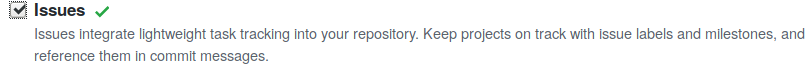

# Ruby on Rails Introductory Exercise

This is an interactive exercise introducing web development with Ruby on Rails 7.0 based on the [v6.0 Rails Guide](https://guides.rubyonrails.org/v6.0/getting_started.html). It is used in HPI's [Scalable Software Engineerung course](https://hpi.de/plattner/teaching/winter-term-2022-23/scalable-software-engineering.html).

**This exercise is inspired by the offical ["Getting Started with Rails" Guide in version 6.0](https://guides.rubyonrails.org/v6.0/getting_started.html) (explictly in version 6.0, v7.0 is different). So in case of getting stuck, the v6.0 guide is a good starting point to find solutions.**

The interactivity of this exercise is provided by opening issues in the GitHub issue tracker. The issues contain details of the feature to tackle next as well as the currently failing test case and the corresponding error message.

This repository contains an application stub of an **academic paper management system** with a failing test case. Follow these steps to complete the software and the exercise:

## Exercise Steps

### 1) Set up your repository

* Ensure that the issue tracker of your repository is active (i.e. an "Issues" tab is visible). If not, activate it in the `Settings` tab on the GitHub website.

* Ensure that GitHub Actions, the Continuous Integration service that runs tests and facilitates the exercise, is active. If not, [activate it](https://docs.github.com/en/actions/managing-workflow-runs/disabling-and-enabling-a-workflow#enabling-a-workflow) on the `Actions` tab.

### 2) Set up local development environment

Three options to setup your local Ruby on Rails development environment:

#### Option 1: Local setup on Linux or MacOS
* You already have access to a Linux-like environment. Install Ruby (on Rails) directly on your OS

#### Option 2: WSL in Windows
* Install the [Windows Subsystem for Linux](https://docs.microsoft.com/en-us/windows/wsl/install)

#### Option 3: Use a Virtual Machine
* We recommend [Virtualbox](https://www.virtualbox.org) (as a VM provider) and [Vagrant](https://gorails.com/guides/using-vagrant-for-rails-development) (to manage VMs) in combination with Ubuntu Linux.
* Any other container solution, such as [Docker](https://evilmartians.com/chronicles/ruby-on-whales-docker-for-ruby-rails-development) will also work.
* You may want to share the file system with the host OS to use your locally installed tools.

**After you have access to a Linux-like shell:**

* Clone your exercise repository using `git clone`. Cloning via [SSH](https://github.com/settings/ssh/new) instead of HTTPS avoids having to [type credentials when pushing](https://help.github.com/en/github/using-git/which-remote-url-should-i-use).
  * You can follow the how-tos offered by [GitHub Docs](https://docs.github.com/en/free-pro-team@latest/github/authenticating-to-github/connecting-to-github-with-ssh) to [generate a new SSH key](https://docs.github.com/en/free-pro-team@latest/github/authenticating-to-github/generating-a-new-ssh-key-and-adding-it-to-the-ssh-agent) and to [add it to your GitHub account](https://docs.github.com/en/free-pro-team@latest/github/authenticating-to-github/adding-a-new-ssh-key-to-your-github-account).
* In the newly cloned folder (`cd` into it), check the Ruby version: `ruby --version`. It should be `2.7.4` (or higher).
* If the correct Ruby version is not used, install a ruby version manager: either [rbenv](https://github.com/rbenv/rbenv#installation) including [ruby-build](https://github.com/rbenv/ruby-build#readme)) (recommended) *or* [RVM](https://rvm.io/).
* Install the required Ruby version: e.g. `rbenv install 2.7.4` (might take a few minutes, requires *ruby-build*)
* The `.ruby_version` file in the repository instructs the ruby version manager to use the correct version.
* Please let the teaching team/your fellow students know if there are problems. Most likely someone else has had similar issues already and can help.

### 3) Dive into the code

* Run `bundle install` to install the dependencies of the project (they are stored in the `Gemfile`)
  * If the `bundle` command was not found, install bundler with `gem install bundler`
* Run `rails db:migrate RAILS_ENV=development && rails db:migrate RAILS_ENV=test` to migrate the database
* Start the development server (`rails s`) and check that the application runs (default: `http://localhost:3000/`). When running in WSL/container: `rails s -b 0 # -b required to not drop requests coming from host OS`
* Run `bundle exec rspec` to run the tests ([RSpec](http://rspec.info/) is a test framework for Ruby)
* Write code to get the failing test to pass.

### 4) Commit and push

* When the tests pass on your local machine, push your changes to GitHub.
* GitHub Actions workflows will run. You can check their state using the `Actions` tab on the repo website.

### 5) Check your inbox / issues

* You will be notified of problems or new  work items via GitHub issues on your repository.
* While you wait, continue to read the [Guide](https://guides.rubyonrails.org/v6.0/getting_started.html), or explore the project files.

### 6) For each issue

* Write a new test that documents the missing or failing behavior.
* Commit the failing test and reference the issue.
  * The commit message could be `Failing test for #<ISSUE NUMBER>`.
  * There is no need to push the failing commit.
* Fix the issue and make your test pass. Then commit the changes.
  * While an issue is open, the exercise will try to create comments on the issue, notifying you of errors.

### 7) Repeat steps 4 to 6 until the exercise is complete.

## Tips

* The main goal of this exercise is to learn the basics of Ruby on Rails. **Don't hesitate to ask the teaching team or your fellow students for help!**
* The beginning of this exercise is based on the official ["Getting Started with Rails" Guide (v6.0, **not** 7.0)](https://guides.rubyonrails.org/v6.0/getting_started.html). When stuck, this should be your first read.
* `rails s` starts the development server (by default on http://localhost:3000) so you can try out your app in the browser.
* `rails routes` shows all available routes of the application.
* For help with RSpec matchers, there is a [Cheat Sheet](https://devhints.io/capybara#rspec) or the [documentation](http://www.rubydoc.info/github/teamcapybara/capybara/#Querying)
* Run `rspec spec/<path_to_spec>.rb` to only run tests within a single file.
* Have a look at `/spec/factories` to get inspiration for your data model.
* Besides [generators](https://guides.rubyonrails.org/command_line.html#rails-generate) and scaffolds, [associations](https://guides.rubyonrails.org/association_basics.html) and [validations](https://guides.rubyonrails.org/active_record_validations.html) are needed.
* `rails db:drop && rails db:migrate` deletes the database and recreates it. This might be helpful for error recovery.
* Make sure that all local changes are committed (`git status`) and pushed to the upstream repository (i.e., the one on GitHub) before the deadline.
